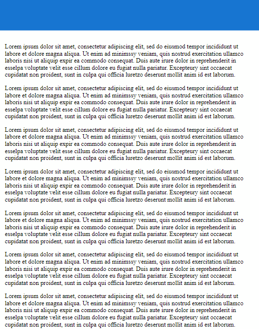

<p align="center">
  <a href="https://www.ProAngular.com" target="_blank">
    
  </a>
  <h1 align="center">
    <a href="https://www.ProAngular.com" target="_blank">
      Pro Angular
    </a>: Scroll Top Button
  </h1>
</p>

[](https://badge.fury.io/js/@proangular%2Fngx-scroll-top)
[](https://www.npmjs.com/@proangular/ngx-scroll-top)
[](https://gitter.im/ProAngular/community)
[](https://github.com/ProAngular/ngx-scroll-top/actions/workflows/on-merge-main-deploy-gpr.yml)
[](https://github.com/ProAngular/ngx-scroll-top/actions/workflows/on-merge-main-deploy-npmjs.yml)

# Description

Configurable, lightweight back to top button for Angular projects.

# Demo

<p align="center">
  
</p>

To run this demo:
* `git clone https://github.com/ProAngular/ngx-scroll-top.git`
* `cd ngx-scroll-top`
* `npm install`
* `npm run start`

# Installation and importing

## Installation

Angular
```bash
ng add @proangular/ngx-scroll-top@latest
```

Direct
```bash
npm install @proangular/ngx-scroll-top --save
```

## Import

Import package into the module of your choice
```diff
...
+ import { NgxScrollTopModule } from '@proangular/ngx-scroll-top';
...

@NgModule({
  imports: [
    ...
+   NgxScrollTopModule
  ],
  ...
})
export class AppModule { }
```

# Usage and Examples

Default use (blue button with white icon)
```html
<ngx-scroll-top></ngx-scroll-top>
```

Example with optional inputs
```html
<ngx-scroll-top
  backgroundColor="#0D58C0"
  [bottomOffset]="footer.height"
  [displayAtYPosition]="1000"
  fontColor="#FFFAFA"
  fontSize="2rem"
  height="3rem"
  position="left"
  [zIndex]="1"
  width="3rem"
>&#8686;</ngx-scroll-top>
```

# Component API

| Input                  | Value Typing          | Default Value           | Description                                                                                                                                        |
| ---------------------- | --------------------- | ----------------------- | -------------------------------------------------------------------------------------------------------------------------------------------------- |
| **backgroundColor**    | string                | `'#0D58C0'` (dark-blue) | Background color of the back to top button. Define any `'x'` css property available for `'background-color: x'`.                                   |
| **bottomOffset**       | string \| number      | `'0px'`                 | Offset `px` from bottom of page when scrolled to bottom. For example this can be used to make sure the back to top button never overlaps a footer. |
| **displayAtYPosition** | string \| number      | `'420px'`               | The back to top button will not be displayed until the user scrolls to the provided Y (vertical `px`) coordinate on the page.                      |
| **fontColor**          | string                | `'#FFFFFF'` (white)     | The font color for the nested content within the back to top button. Define any `'x'` css property available for `'color: x'`.                     |
| **fontSize**           | string                | `'16px'`                | The font size for the nested content within the back to top button. Define any `'x'` css property available for `'font-size: x'`.                  |
| **height**             | string                | `'40px'`                | Height of back to top button in string px format.                                                                                                  |
| **position**           | `'left'` \| `'right'` | `'right'`               | Position on-screen where the back to top button is displayed.                                                                                      |
| **width**              | string                | `'40px'`                | Width of back to top button in string px format.                                                                                                   |
| **zIndex**             | number                | `999`                   | Style the `z-index` for the back to top button as needed for correct layer height adjustment. This can be useful when working with sticky headers. |

# Compatibility

| Angular version | @proangular/ngx-scroll-top | Install                                    |
| --------------- | -------------------------- | ------------------------------------------ |
| v14             | v1.x.x                     | `ng add @proangular/ngx-scroll-top@latest` |
| v13             | v1.x.x                     | `ng add @proangular/ngx-scroll-top@latest` |
| v12             | v1.x.x                     | `ng add @proangular/ngx-scroll-top@latest` |

# Development

1. Clone, create new branch.
* `git clone https://github.com/ProAngular/ngx-scroll-top.git`
* `git checkout -b username/feature`
2. Bump version of package in `package.json` and `package-lock.json`, commit all changes, push.
* `git add -A`
* `git commit -m "My commit message"`
* `git push origin username/feature`
3. Submit code in published PR for review and approval. Add a good description and link any possible user stories or bugs.
* [Create a new pull request](https://github.com/ProAngular/ngx-scroll-top/compare).
4. Allow CI actions to completely run and verify files.
5. Add/ping reviewers and await approval.

Thank you for any and all contributions!

# Donation

As a husband and father of four children, your donations mean the world to me! Any donations are greatly appreciated and keep me going!
* [https://www.paypal.me/CodyTolene](https://www.paypal.me/CodyTolene)
* [https://github.com/sponsors/ProAngular](https://github.com/sponsors/ProAngular)

# License

Copyright &copy; 2022 [Cody Tolene](https://www.CodyTolene.com)

All content is licensed under the [MIT license].

[mit license]: LICENSE
